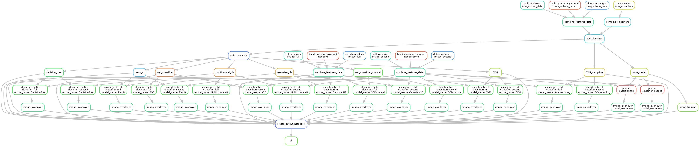
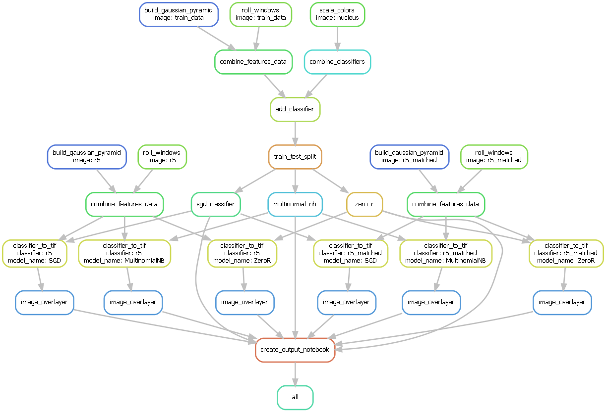

# Project Ipy #
Project Ipy is an image segmentation pipeline. The pipeline is build using snakemake. 
The goal of the pipeline is to build a consistent machine learning workflow for image 
segmentation purposes.

## Table of content

- [Project description](#project-description)
- [Installation](#installation)
    * [Prerequisites](#prerequisites)
    * [Packages](#packages)
- [Running the pipeline](#running-the-pipeline)
    * [Config](#config)
    * [Algorithms](#algorithms)
- [Rules](#rules)
    * [Visualisation](#visualisation)
    * [Rules list](#rules-list)
- [Contact](#contact)
- [Acknowledgements](#acknowledgements)

## Project description
This project is a web application that seeks to give insight into the energy consumption
of the machines in the BIN facility. This is done by creating an energy dashboard
that displays the energy consumption over multiple time periods of all the machines on the network.
The dashboard aims to constantly give the most up-to-date information by constantly updating the data in 
the background without having to refresh the webpage. The historical data is saved in a database that can 
be accessed by the backend of the application. Updating the database is done using a separate script.

To get the energy usage of the machines a simple linear model is used. This model uses the data from Prometheus,
which can be accessed through the Grafana API. A more complex neural network implementation was tested but failed 
to outperform the simple linear model. This was most likely due to the quality of the dataset that was built and used.

## Installation
To install the pipeline you must clone this repository. You can do this using
the following command:
```
git clone https://github.com/devalk96/Project-Ra.git
```

To install the required packages you can use:
``pip install -r requirements.txt``  
It is recommended that you install the required packages 
in a separate virtual environment.

### Prerequisites
* Python version 3.x.x

### Packages
|Name                                   |Version                |   
|---                                    |---                    |
|dask                                   |2022.4.0               |
|dask_ml                                |2022.1.22              |
|h5py                                   |3.6.0                  |
|joblib                                 |1.1.0                  |
|numpy                                  |1.21.5                 |
|opencv_python                          |4.5.5.64               |
|Pillow                                 |9.1.0                  |
|scikit_learn                           |1.0.2                  |
|scikit_optimize                        |0.9.0                  |
|scipy                                  |1.8.0                  |
|snakemake                              |7.3.8                  |
|nbformat                               |5.0.8                  |

**Important**   
Make sure that you use nbformat 5.0.8 or lower. This is because in the 5.1.0 update an id variable was added 
to the building of notebooks in this package. This is something jupyter notebook can't work with.
This means the pipeline will not work correctly on any version after 5.0.8.

## Running the pipeline
To run the pipeline after installing the requered packages, you can run the following command from the 
main Ipy directory (current directory):  
```
snakemake --cores {cores}
```

This will run the pipeline using the config specified in the config directory. Replace {cores} with the 
amount of cores you wish to use. 

**Important**  
If you do not have 16GB of ram (or more) on your machine it is highly advised not to use more than 2 cores.
This is due to the fact that some the scripts in this pipeline use a lot of ram. Specifing the usage of 2 
cores will make sure that at any moment only two scripts are run in parallel. Even though the scripts only need one
thread they will use a single core and not a single thread, even when hyperthreading is available. This has to do
with the way hyperthreading works.

#### Config
The config.yaml file has a few options. 

|Name               |Usage                                                          |Value                                      |
|---                | ---                                                           |---                                        |
|datadir            | directory containing images the pipeline should use           | string, absolute path                     |
|dataset_dir        | directory where the dataset that are created should be stored | string, absolute path                     |
|results_dir        | directory where the results should be stored                  | string, absolute path                     |
|train_data         | image in the datadir that should be used as the training data | string, relative path to datadir          |
|classifiers        | dictionary of images to use as classifiers                    | name: location (relative path to datadir) |
|segment            | dictionary of images to segment using the trained models      | name: location (relative path to datadir) |
|gaussian_layers    | amount of gaussian pyramid to build for training              | integer                                   |
|window_size        | size of the window to get neighbouring pixel values           | tuple, (horizontal, vertical)             |
|algorithms         | machine learning algorithms that should be trained            | list of algorithms                        |

#### Algorithms
Currently the following machine learning algorithms are available:
- SGD
- MultinomialNB
- GaussianNB
- ZeroR

Multinomial Naive bayes is currently implemented with weighted samples. The SGD classifier is implemented with 
automated hyperparameter tuning and weighted classes. This is the reason you can't specify hyperparameters in 
the config file


## Rules
### Visualisation

The pipeline when using all available features:


The pipeline when using select group of features:



### Rules list
``build_gaussian_pyramid``: Builds a dataset of gaussian pyramid layers 
of an image.  
``roll_windows``: Builds a dataset of neighbouring pixel values for a given image.  
``scale_colors``: Convert given classifier image from rgba to 0 and 1 values.  
``combine_classifiers``: Convert all given classifier images into single classifier list.  
``combine_features_data``: Combine data subsets into single dataset.  
``add_classifier``: Add classifier to training data.  
``train_test_split``: Split training data into train and test data.  
``sgd_classifier``: Train SGDClassifier on data.  
``gaussian_nb``: Train gaussian naive bayes classifier on data.  
``zero_r``: Train ZeroR classifier on data.  
``multinomial_nb``: Train multinomial naive bayes classifier on data.  
``classifier_to_tif``: Segment an image using the a trained models.  
``image_overlayer``: Overlay a segmented image with the original image.  
``create_output_notebook``: Create a notebook with the final visualizations.


## Contact
* K.A. Notebomer
  * k.a.notebomer@st.hanze.nl
  * [Skippybal](https://github.com/Skippybal)
 
 
## Acknowledgements
I would like to thank S.J. Bouwman ([devalk96](https://github.com/devalk96)) for developing the 
image_overlayer and classifier_cleaner scripts, and letting me convert them into 
scripts that can be used with snakemake.